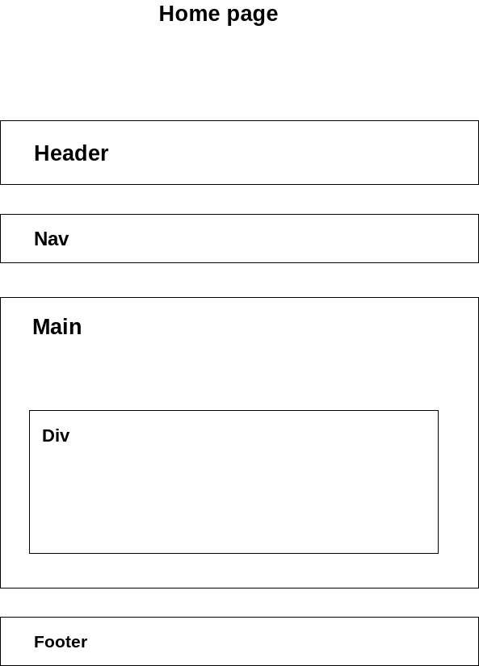

# Coffee Lover Initial Study

    Jon Johnson is the owner of the Coffee Lover Coffee Bar, a gourmet
    coffee shop that serves snacks, coffee, tea, and soft drinks.
    Local folk music performances and poetry readings are held a
    few nights during the week. The customers of Coffee Lover are
    mainly college students and young professionals. Jon would
    like a web presence for his shop that will display his services
    and provide a calendar for the performances. He would like a
    home page, menu page, music performance schedule page,
    and job opportunities page.

## Content By sections

    - Music Performance page

    - Home page

    - Menu page

    - Job page

## IA represented as a site map

## Wireframe Diagrams

    Home page layout and structure

